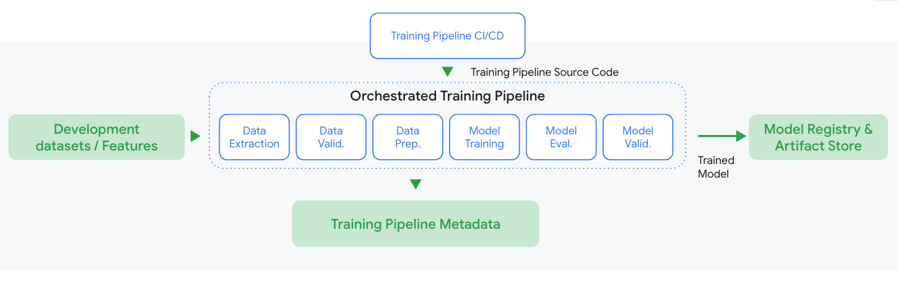
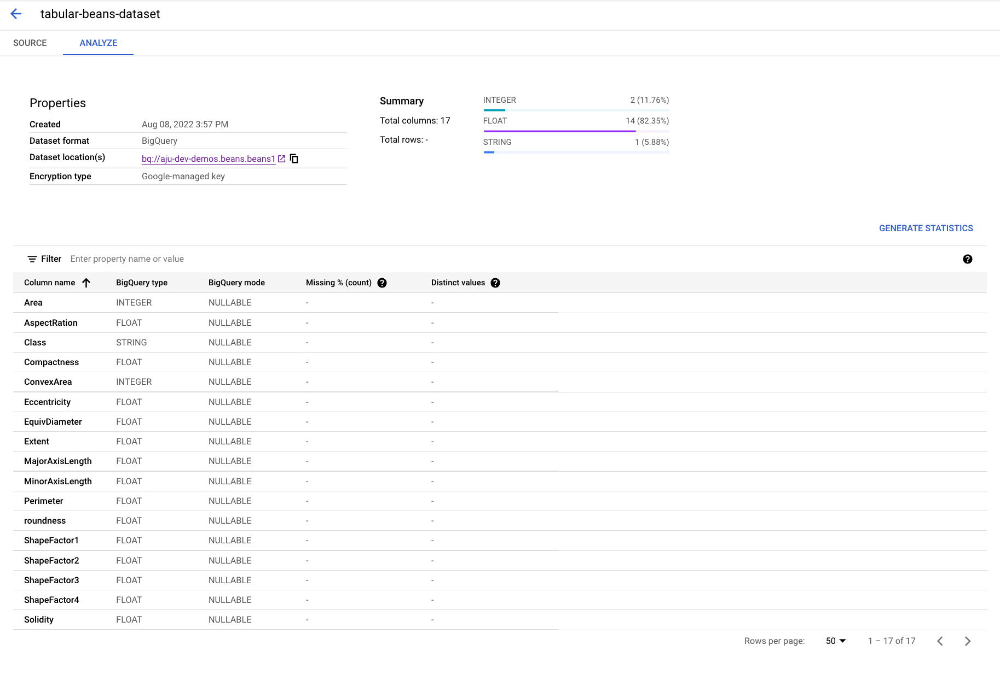
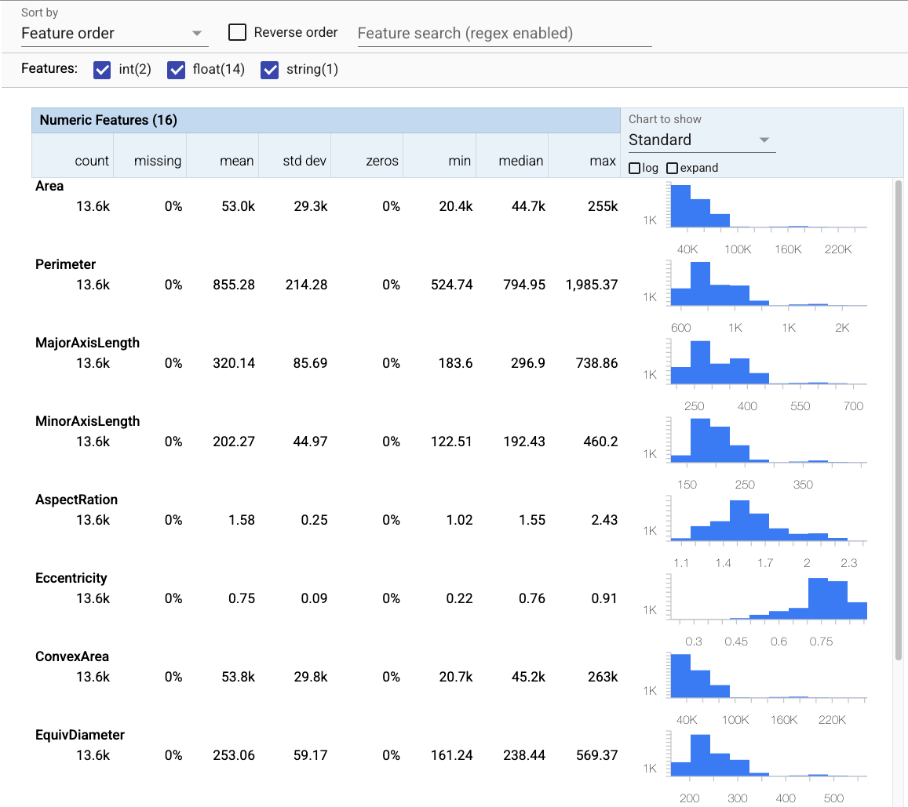
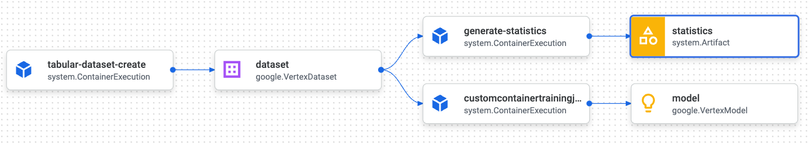
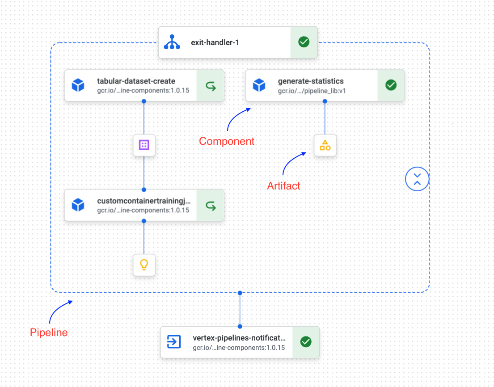

# KFX

There are many [Vertex AI sample code](https://github.com/GoogleCloudPlatform/vertex-ai-samples/tree/main/notebooks/official/pipelines) out there on how to build machine learning pipelines, but most of them are Jupyter Notebook samples and are one off approaches. They do not cover a holistic approach to building a framework that is reusable and ready for scale in a production environment.

This educational repo takes things further and goes through creating a library with modular Kubeflow components that can be used by multiple teams across an organization without having to re-invent the wheel. It builds the primary steps of a machine learning pipeline applying SDLC methodology and devops.

Let's get started.

## Introduction

MLOps is the application of devops principles and practices to machine learning workflows. The goals are to provide an environment of:
- Fast experimentation.
- Faster deployment of models to production.
- More collaboration.
- Better data quality assurance and governance.

By using MLOps, organizations unlock ROI by providing a technological backbone for managing the machine learning lifecycle through automation and scalability. 

A typical machine learning workflow is composed of a set of steps that work together to achieve a business objective. 



Along that path, organization face many challenges, such as data quality/governance issues, explainability/reproducibility of results and high costs. There are more challenges, but we'll be focusing our pipeline on solving these to show the value of MLOps.

1. Our pipeline will take a BigQuery dataset and import it into a Vertex AI dataset.

    <center></center>

1. We will generate a custom component that uses the [tensorflow_data_validation](https://www.tensorflow.org/tfx/data_validation/get_started) python package to generate statistics of our data.

    <center></center>

1. We will train a scikit-learn model using a custom training job. The pipeline will track all lineage of steps and artifacts.

    <center></center>

## Tools

This repo uses: 
- [Vertex AI pipelines](https://cloud.google.com/vertex-ai/docs/pipelines/introduction).
- [Dataflow](https://cloud.google.com/dataflow) (Optional).

## Structuring the Code

**Vertex AI pipelines** is a managed service for running [Kubeflow Pipelines](https://www.kubeflow.org/docs/components/pipelines/introduction/). It has the advantage of managing the underlying Kubernetes/Kubeflow infrastructure so organizations can focus on innovating. 

**Kubeflow Pipelines** is a platform for building and deploying portable, scalable machine learning (ML) workflows based on Docker containers. The main components are:
- **Components** : self-contained set of code that performs one step in the ML workflow (pipeline), such as data preprocessing, data transformation, model training, and so on. A component is analogous to a function, in that it has a name, parameters, return values, and a body.
- **Pipelines** : a description of a machine learning (ML) workflow, including all of the components in the workflow and how the components relate to each other in the form of a graph. The pipeline configuration includes the definition of the inputs (parameters) required to run the pipeline and the inputs and outputs of each component.
- **Graph** : a pictorial representation in the Kubeflow Pipelines UI of the runtime execution of a pipeline. The graph shows the steps that a pipeline run has executed or is executing, with arrows indicating the parent/child relationships between the pipeline components represented by each step.
- **Artifacts** : an output emitted by a pipeline component, which the Kubeflow Pipelines UI understands and can render as rich visualizations. It’s useful for pipeline components to include artifacts so that you can provide for performance evaluation, quick decision making for the run, or comparison across different runs.
- **Metadata** : Kubeflow Pipelines backend stores runtime information of a pipeline run in Metadata store. Runtime information includes the status of a task, availability of artifacts, custom properties associated with Execution or Artifact, etc.

<center></center>

Understanding these concepts is crucial to building scalable and reusable libraries for which organizations rely on to build their MLOps systems. Because pipelines are built with components and components are the equivalent of modulerized function definitions based on Docker containers, then we want to structure the code in a way that components can be reused across multiple pipelines. So the code structure looks something like.

```bash
kfx
├── Dockerfile
├── setup.py
├── requirements.txt
├── components
│   ├── component_1
│   ├── component_2
├── pipelines
│   ├── pipeline_1
│   ├── pipeline_2

```

### Dockerfile

We build a custom container image to hold our dependencies and library for our components to use. The Dockerfile looks something like this:

```Docker
FROM python:3.8

WORKDIR /

COPY ./kfx /kfx

COPY setup.py setup.py

RUN python setup.py install
```

This is the base image that our custom Kubeflow components will use. It packages all the dependencies we need to execute a step in our pipeline.

### Building Custom Components

Kubeflow is an open source project and comes with a rich set of common components to perform common tasks. As an example, Google has built over [60 components](https://cloud.google.com/vertex-ai/docs/pipelines/gcpc-list) for organizations to use and integrate with many services in Google Cloud such as Vertex AI, AutoML, BigQuery, Dataproc (Spark) and Dataflow (Beam).

Kubeflow also has the capabilities to create custom components. This functionality makes Kubeflow pipelines very extendable and organizations can build just about anything they can package in a Docker container. There are many ways to build custom components, but here we'll only cover python function based components. Python function-based components make it easier to iterate quickly by letting you build your component code as a Python function and generating the [component specification](https://www.kubeflow.org/docs/components/pipelines/reference/component-spec/) for you.

To build a custom component, we use the @component annotation that is included in the [kfp SDK](https://github.com/kubeflow/pipelines).

```python
from kfp.v2.dsl import component

@component()
def empty_component():
    print("this is a test component")
```

We can also set inputs and outputs, set a base Docker image to use to run our component and python depencencies we would like to install in our component to run our functions.

```python
from kfp.v2.dsl import component
from typing import NamedTuple

@component(base_image="python:3.9", packages_to_install=["emoji"])
def emoji(text: str
         ) -> NamedTuple("Outputs", [("emoji_text", str), ("emoji",str)]):
    import emoji
    
    emoji_text = text
    emoji_str = emoji.emojize(':' + emoji_text + ':', use_aliases=True)
    print("output one: {}; output_twp: {}".format(emoji_text, emoji_str))
    return (emoji_text, emoji_str)
``` 

This way we can use our Dockerfile to build a container image, push it to Google Cloud [Artifact](https://cloud.google.com/artifact-registry) or [Container](https://cloud.google.com/container-registry) Registry and use it inside our components.

```python
def build_container(container_uri):
    result = subprocess.run(['docker','build','.','-t',container_uri])
    if result.stderr:
        print("error running docker build")
        print("stderr:", result.stderr)

def push_container(container_uri):
    result = subprocess.run(['docker','push',container_uri])

container_uri = f"gcr.io/{args.project_id}/pipeline_lib:{args.pipeline_container_version}"
build_container(container_uri)
push_container(container_uri)

@component(base_image=container_uri)
def generate_statistics(bq_source: str,
                        bucket: str,
                        job_id: str,
                        project_id : str,
                        network: str,
                        subnet: str,
                        region: str,
                        beam_runner : str,
                        statistics : Output[Artifact]):
    
    from kfx.utils.bq_utils import bq_table_to_df, bq_table_to_gcs_in_csv
    from kfx.utils.str_utils import write_file

    print("this component generates statistics from a BQ source.")
```

### Training code

Pipelines will contain custom training code that should live in its own git repository. We will be using the `CustomContainerTrainingJobRunOp` to execute a [Vertex AI custom training job](https://cloud.google.com/vertex-ai/docs/training/create-custom-job). We can store the code with the following structure:

```bash
my-training-code
├── Dockerfile
├── trainer
│   ├── train.py
```

We can use our Dockerfile to build a container image, push it to Google Cloud [Artifact](https://cloud.google.com/artifact-registry) or [Container](https://cloud.google.com/container-registry) Registry and reference it inside the `CustomContainerTrainingJobRunOp`.

**I've kept the training code in this repo to keep everything self contained.**

### Building a Pipeline

We can use the `@pipeline` annotation from the kfp SDK. Components are stiched together by declaring the output of one as an input of another. The net effects of this are:

1. Any component that depends on the output of one or more components runs after all upstream components have finished running. 
1. Whichever components that has no upstream depedencies will run in parallel.
1. The pipeline tracks lineage of the pipeline through the ML metadata store and helps with debugging and governance.

Through the `Google pipeline components` library, we can create Vertex AI Datasets, create custom training jobs and more without having to build our own custom components.

```python

import os
import kfp
from kfp.v2 import compiler, dsl
import kfp.dsl as dsl
from kfp.v2.dsl import pipeline
from google.cloud import aiplatform
import google_cloud_pipeline_components as gcpc
from google_cloud_pipeline_components import aiplatform as gcc_aip
from google_cloud_pipeline_components.experimental import vertex_notification_email
from datetime import datetime
from kfx.components.statistics_gen import bq_statistics_gen

@pipeline(name=args.pipeline_name, pipeline_root=pipeline_root)
def pipeline(
    bq_source: str = args.bq_source,
    bucket: str = args.bucket,
    project: str = args.project_id,
    job_id: str = args.job_id,
    region: str = "us-central1"
):
    notify_email_task = vertex_notification_email.VertexNotificationEmailOp(
                recipients=args.recipients)
            
    with dsl.ExitHandler(notify_email_task):
        
        dataset_create_op = gcc_aip.TabularDatasetCreateOp(
            display_name="tabular-beans-dataset",
            bq_source=bq_source,
            project=project,
            location=region
        )
        
        generate_statistics_op = bq_statistics_gen.generate_statistics(bq_source=args.bq_source, 
                                                        bucket=args.bucket, 
                                                        job_id=job_id, 
                                                        project_id=args.project_id,
                                                        network=args.network,
                                                        subnet=args.subnetwork,
                                                        region=region,
                                                        beam_runner=args.beam_runner)
        
        training_op = gcc_aip.CustomContainerTrainingJobRunOp(
            display_name="pipeline-beans-custom-train",
            container_uri=args.training_container_uri,
            project=project,
            location=region,
            dataset=dataset_create_op.outputs["dataset"],
            staging_bucket=bucket,
            training_fraction_split=0.8,
            validation_fraction_split=0.1,
            test_fraction_split=0.1,
            bigquery_destination=args.bq_dest,
            model_serving_container_image_uri="us-docker.pkg.dev/vertex-ai/prediction/sklearn-cpu.0-24:latest",
            model_display_name="scikit-beans-model-pipeline",
            environment_variables={"GCS_BUCKET" : bucket_name},
            machine_type="n1-standard-4",
        )

```

In our pipeline, we only had to build one custom component, `bq_statistics_gen.generate_statistics`, while reusing components from the `Google pipeline components` library.

## Running a Pipeline

1. First you'll need to enable a couple of GCP APIs. You can run the following command from cloud shell.

    ```bash
    gcloud services enable compute.googleapis.com         \
                        containerregistry.googleapis.com  \
                        aiplatform.googleapis.com  \
                        cloudbuild.googleapis.com \
                        cloudfunctions.googleapis.com \
                        dataflow.googleapis.com
    ```

1. Create a Google Cloud Storage bucket, where `<project_id>` is your project id from the GCP console.

    ```bash
    BUCKET_NAME=gs://<project_id>-bucket
    gsutil mb -l us-central1 $BUCKET_NAME
    ```
1. Next, we'll create a service account, give it access to the created bucket and add the necessary permissions needed to run Vertex AI pipelines. If you are using cloud shell, you can use this exact command which will extract the `PROJECT_ID`, else, make modifications to set the `PROJECT_ID`.

    ```bash
    gcloud projects describe $GOOGLE_CLOUD_PROJECT > project-info.txt
    PROJECT_ID=$(cat project-info.txt | sed -nre 's:.*projectId\: (.*):\1:p')
    gcloud iam service-accounts create vertex-ai \
        --description="My Vertex-AI account" \
        --display-name="vertex-ai"
    SVC_ACCOUNT=vertexai@${PROJECT_ID}.iam.gserviceaccount.com
    gcloud projects add-iam-policy-binding $GOOGLE_CLOUD_PROJECT --member serviceAccount:$SVC_ACCOUNT --role roles/storage.objectAdmin
    gcloud projects add-iam-policy-binding $GOOGLE_CLOUD_PROJECT --member serviceAccount:$SVC_ACCOUNT --role roles/dataflow.admin
    gcloud projects add-iam-policy-binding $GOOGLE_CLOUD_PROJECT --member serviceAccount:$SVC_ACCOUNT --role roles/dataflow.worker
    gcloud projects add-iam-policy-binding $GOOGLE_CLOUD_PROJECT --member serviceAccount:$SVC_ACCOUNT --role  roles/aiplatform.user
    gcloud projects add-iam-policy-binding $GOOGLE_CLOUD_PROJECT --member serviceAccount:$SVC_ACCOUNT --role  roles/iam.serviceAccountUser
    ```

1. Create a `.env` file in the top level directory (where Dockerfile is located). and add the following line.

    ```bash
    BASE_KFX_IMAGE=gcr.io/<project_id>/pipeline_lib:v1
    ```

1. The [pipeline code](kfx/pipelines/bq_sklearn_train_pipeline/bq_preprocess_train_pipeline.py) takes care of building the Docker images, creating a pipeline and creating a Vertex AI pipeline job. Change the variables accordingly to your project. If you don't have a VPC set up, then the network should be `default`. You can also choose to run the [generate_statistics](kfx/components/statistics_gen/bq_statistics_gen.py) component using the `DataflowRunner` which will create a Dataflow job, or the `DirectRunner` which will run your job in the local component's container.

    ```bash
    PROJECT_ID=<project_id>
    BUCKET=gs://$PROJECT_ID-bucket
    IMAGE_URI=gcr.io/$PROJECT_ID/scikit:v1
    NETWORK=$PROJECT_ID-network
    SUBNETWORK=$PROJECT_ID-subnet
    python kfx/pipelines/bq_sklearn_train_pipeline.py/bq_preprocess_train_pipeline.py --bucket gs://$PROJECT_ID-bucket \
    --pipeline-root my-pipeline-root \
    --job-id my-beans-pipeline-1234 \
    --project-id $PROJECT_ID \
    --pipeline-name my-first-pipeline \
    --bq-source bq://aju-dev-demos.beans.beans1 \
    --bq-dest bq://$PROJECT_ID \
    --recipients some-recepient@google.com \
    --service-account vertex-ai@$PROJECT_ID.iam.gserviceaccount.com \
    --network $NETWORK \
    --subnetwork $SUBNETWORK \
    --beam-runner DataflowRunner \
    --build-pipeline-container true \
    --pipeline-container-version v1
    ```